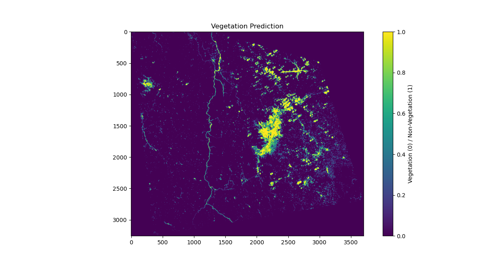

# Vegetation Mapping with EVI and SVM using Landsat 8-9 Imagery

This repository contains a complete workflow for vegetation classification using the Enhanced Vegetation Index (EVI) derived from Landsat 8-9 Level-2 satellite imagery. The project implements a supervised machine learning pipeline using a Support Vector Machine (SVM) classifier to distinguish between vegetated and non-vegetated areas. The methodology is validated by training the model on a region in Neiva, Colombia, and applying it to make predictions on a separate region in Urrao, Colombia.

## 📖 Project Description

Remote sensing vegetation indices are crucial for monitoring environmental health, agriculture, and land use change. While NDVI is widely used, it can saturate in dense vegetation and is sensitive to atmospheric conditions. This project leverages the **Enhanced Vegetation Index (EVI)** , which offers improved sensitivity in high-biomass regions and includes atmospheric and canopy background corrections.

The core of this project is a reproducible framework that:
1.  **Preprocesses** Landsat imagery, including crucial cloud masking using the QA_PIXEL band.
2.  **Calculates** EVI from the Blue, Red, and Near-Infrared (NIR) spectral bands.
3.  **Trains** a linear Support Vector Machine (SVM) classifier on a labeled dataset derived from the EVI and spectral bands.
4.  **Evaluates** the model's performance and visualizes its decision boundaries.
5.  **Applies** the trained model to new, unseen satellite imagery to generate a vegetation mask.

The project achieved a high classification accuracy (≥ 0.9), demonstrating the effectiveness of combining EVI with an SVM classifier for robust vegetation mapping.

## ✨ Key Features

- **Complete End-to-End Pipeline:** From raw Landsat GeoTIFFs to a final vegetation classification map.
- **Cloud Masking:** Implements bit-masking on the `QA_PIXEL` band to filter out clouds and cloud shadows, a critical step for accurate optical remote sensing analysis.
- **EVI Calculation:** Provides a precise implementation of the EVI formula as used by the USGS for Landsat data.
- **Balanced Sampling:** Addresses class imbalance by creating a stratified dataset for robust model training.
- **Machine Learning Classification:** Utilizes a `scikit-learn` SVM with a linear kernel for clear and interpretable decision boundaries.
- **Model Transferability:** Demonstrates the model's ability to generalize by predicting vegetation on a geographically distinct region (Urrao).
- **Geospatial I/O:** Uses `rasterio` and `GDAL` for efficient reading and writing of georeferenced raster data.

## 🗺️ Study Area & Data

The project uses data from two distinct regions in Colombia:

| Site | Purpose | Acquisition Date | Coordinates |
| :--- | :--- | :--- | :--- |
| **Neiva** | Training & Testing | 2024-04-10 | 2.9345° N, 75.2809° W |
| **Urrao** | Validation & Prediction | 2023-08-01 | 6.3139° N, 76.1318° W |

**Data Source:** [Landsat Collection 2 Level-2](https://www.usgs.gov/landsat-missions/landsat-collection-2-level-2-science-products) (Landsat 8-9 OLI/TIRS C2 L2) from the USGS EarthExplorer. Level-2 data provides surface reflectance, which is already atmospherically corrected.

**Bands Used:**
- **Band 2 (Blue):** `SR_B2.TIF`
- **Band 4 (Red):** `SR_B4.TIF`
- **Band 5 (NIR):** `SR_B5.TIF`
- **QA_PIXEL Band:** `QA_PIXEL.TIF` (for cloud and shadow masking)

## 🛠️ Methodology

The project workflow is divided into two main Python scripts:

### 1. Preprocessing and EVI Calculation (`Create_EVI_TIF.py`)

This script processes raw Landsat bands to generate a cloud-masked EVI GeoTIFF.

- **Read Bands:** Loads the Blue, Red, NIR, and QA_PIXEL bands as NumPy arrays.
- **Cloud Masking:** Creates a binary mask by analyzing the `QA_PIXEL` band. Pixels identified as cloud or cloud shadow (bits 3 and 4) are masked out.
- **EVI Calculation:** Computes EVI only for clear pixels using the standard formula:
    
    `EVI = 2.5 * (NIR - Red) / (NIR + 6 * Red - 7.5 * Blue + 1)`
    
    where the input bands are surface reflectance values scaled by a factor of 10,000.
- **Output:** Saves the resulting EVI raster and the cloud mask as GeoTIFF files.

### 2. Machine Learning Classification (`EVI_MachineLearning.py`)

This script performs the classification task using the previously generated EVI data and spectral bands.

- **Data Loading & Labeling:** Loads the EVI, spectral bands, and a corresponding label raster. The labels (`labels_Neiva.tif`) are binary rasters (e.g., 1 for vegetation, 0 for non-vegetation), created externally (e.g., in QGIS) by thresholding EVI or manual digitization.
- **Exploratory Data Analysis (Commented Out):** Contains code for generating histograms, pairplots, and correlation matrices to understand feature distributions and relationships.
- **Balanced Sampling:** Due to potential class imbalance (e.g., much more non-vegetation than vegetation), the code samples an equal number of pixels from each class to create a balanced training dataset.
- **Feature Selection:** The model uses **EVI, Red, and NIR bands** as input features (seen as the most influent variables according to correlation matrix analysis).
- **Model Training:** Splits the balanced data into training (90%) and testing (10%) sets and trains a linear **Support Vector Machine (SVM)** classifier.
- **Evaluation:** Calculates accuracy and generates a detailed classification report on the test set.

The trained model can then be applied to new data (e.g., the Urrao region) by repeating the preprocessing steps and using `svm_model.predict()`.

## 📊 Key Results

- **High Accuracy:** The linear SVM model achieved a classification accuracy of **≥ 0.9** on the test dataset.
- **Feature Importance:** The Near-Infrared (NIR) band showed the highest reflectance values, a key signature of healthy vegetation. A strong correlation was found between the Blue and Red bands (r = 0.904), indicating potential redundancy.
- **Successful Transferability:** The model trained on Neiva successfully generated a coherent vegetation mask for the Urrao region, demonstrating its ability to generalize across different landscapes and acquisition dates.
- **Cloud Sensitivity:** The results highlighted that while cloud masking is effective, residual cloud contamination or shadows can still introduce classification errors, underscoring the need for meticulous preprocessing.

## 👥 Author

- **Juan Diego Ospino** - *Aerospace Engineering, Universidad de Antioquia*